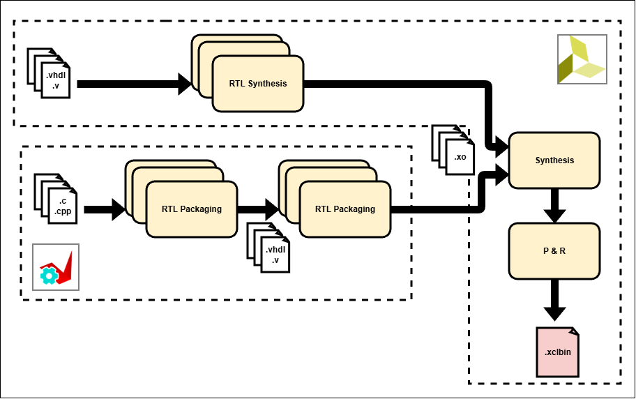

# FPGA Makefile Toolchain

This repository contains the basic files to automate the procedure of FPGA testing and kernel implementation
The general flow of the tool is illustrated by the following figure:
<p align="center">
    
</p>


## Requirements

The tool is tested with the following setup:

- Vivado: 2021.1+ (Tested up to 2023.2)
- Vitis: 2021.1+ (Tested up to 2023.2)
- GNU make: 4.1+ (On Windows, use the included `make.bat` wrapper if `make` is not in PATH)
- **OS**: Linux (Ubuntu/CentOS/RHEL) or Windows 10/11

The tool is expected to work with minimal adjustments for other versions of the listed software.  
If you encounter any issues, please reach out to the maintainer(s) for assistance.


## User documentation
Copy in your workspace folder (where you wish to run the *make* command) the file under the name *template_settings.mk* and rename it to *MakefileVitis.mk* (the name can change to your liking). Then, make the appropriate changes to the variables, change the path in the last line where the *include* is to point to the Makefile of this repository and, after that, you are ready to run the tool via *make -f MakefileVitis.mk* (Or any other name given previously).

### Tool setup steps

#### Windows
1.  Ensure you have **Vitis** and **Vivado** installed and their `bin` directories in your system `PATH`.
2.  Open a Command Prompt (`cmd.exe`) or PowerShell.
3.  Navigate to your workspace.
4.  Copy `template_settings.mk` to `MakefileVitis.mk`.
5.  Edit `MakefileVitis.mk`:
    - Set `PROJECT_NAME` and `KERNEL_TOP_FUNCTION_NAME`.
    - Update paths to your source files.
    - Set `PLATFORM` to your target FPGA platform (e.g. `xilinx_u200_gen3x16_xdma_2_202110_1`).
    - **Crucial:** Ensure the last line includes the `Makefile` from this repository:
      ```makefile
      include <path_to_cloned_repo>/FPGA-Make-Tool/Makefile
      ```
6.  Run the build:
    ```cmd
    # If make is installed:
    make -f MakefileVitis.mk build_csynth_all
    
    # If make is NOT installed (using wrapper):
    .\make.bat -f MakefileVitis.mk build_csynth_all
    ```

#### Linux
1.  Source Vitis settings: `source <Vitis_install_path>/settings64.sh`.
2.  Follow the same steps as Windows for copying and editing the Makefile.
3.  Run `make -f MakefileVitis.mk ...`


### RTL packaging steps
To package an RTL kernel (Verilog/VHDL) into an XO file:
1.  Create a Makefile (e.g., `MakefileRTL.mk`) that includes `MakefileRTLPkg.mk`.
2.  Define `KERNEL_TOP_MODULE_NAME` and `KERNEL_SOURCES`.
3.  Run `make -f MakefileRTL.mk build_rtl_to_xo_all`.

See `MakefileRTLPkg.mk` for detailed variable definitions.


### Log files
The tool automatically generates logs in the following locations within your build folder:
- `.makefilelogs/`: Contains logs for specific make steps (csynth, xclbin generation).
- `log/`: Contains Vitis/Vivado compiler logs.
- `<start_time>_make.log`: If running with a wrapper script, you might see this.
- `xo/`: Contains generated `.xo` kernel files.
- `temp_files/`: Temporary build artifacts.


## Internal workings of the tool
The tool is structured as a hierarchy of Makefiles:
1.  **Makefile**: The entry point (e.g. `MakefileSingleBitstream.mk`), orchestrating the flow.
2.  **MakefileCommon.mk**: OS detection (Windows/Linux) and common command definitions (`RM`, `MKDIR`).
3.  **MakefileCSynth.mk**: Handles High-Level Synthesis (C++ to RTL).
4.  **MakefileXclbin.mk**: Handles linking kernels into the `.xclbin` bitstream.
5.  **utils.mk**: Helper functions and environment checks.
6.  **scripts/**: TCL scripts invoked by Vivado/Vitis for lower-level tasks.